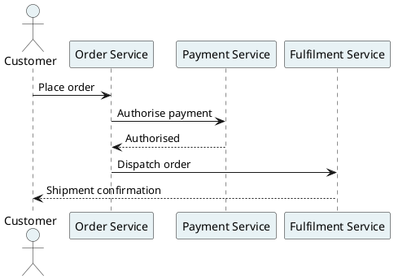

# PlantUML diagrams — adopter guide

This repository uses [PlantUML](https://plantuml.com) for supplementary architectural diagrams (sequence, component, deployment, class, state, activity). Transitrix notation files (goals, BPMN, DGCA, capability map, …) are rendered by Transitrix Studio — this guide covers the separate `.puml` workflow.

---

## 1. Install the extension

**VS Code:** Transitrix Studio renders `.puml` files natively — no separate PlantUML extension needed. If you have followed `GETTING_STARTED.md`, Studio (`transitrix.transitrix-studio`) is already installed. Open any `.puml` file and run **Transitrix: Preview PlantUML** from the Command Palette (`Ctrl+Shift+P` → `transitrixStudio.previewPuml`).

**JetBrains (IntelliJ IDEA, PyCharm, …):** install "PlantUML Integration" by Eugene Steinberg from the JetBrains Marketplace (`com.github.eightpillow.plantuml`).

**Recommended VS Code workspace extensions** are listed in `.vscode/extensions.json` — VS Code will prompt you to install them when you open the repo.

---

## 2. Use the shared header

Every `.puml` file in `diagrams/` starts with:

```plantuml
!include transitrix-theme.puml
@startuml

' ... your diagram content here ...

@enduml
```

> The `@startuml` / `@enduml` delimiters go **after** the `!include` line.

The theme file (`diagrams/transitrix-theme.puml`) does two things:

- **`!pragma layout smetana`** — switches PlantUML to its pure-Java layout engine. This removes the Graphviz external dependency, eliminating the single largest source of "it renders differently on my machine."
- **Transitrix skin** — petrol palette, no shadows, uniform stroke weight; any diagram you produce is recognisably on-brand.

---

## 3. Pinned toolchain (deterministic rendering)

**VS Code:** Transitrix Studio bundles the PlantUML engine internally (no JAR, no Java, no Graphviz). Nothing to configure.

**JetBrains:** the PlantUML Integration plugin uses your local Java + PlantUML JAR. To pin the version:

1. Download the pinned JAR:
   ```
   https://github.com/plantuml/plantuml/releases/download/v1.2024.8/plantuml-1.2024.8.jar
   ```
   Save it to `.plantuml/plantuml.jar` (gitignored; each contributor downloads once).

2. In Settings → Other Settings → PlantUML, set the PlantUML JAR path to `.plantuml/plantuml.jar` and Graphviz to "no external tool" (Smetana layout is active via `!pragma layout smetana` in the theme file, making Graphviz unnecessary).

3. **Java:** JDK or JRE 11+ must be on your `PATH`. `java -version` should succeed.

---

## 4. What a good diagram looks like

- **Structure through petrol** — borders, edges, and connectors use petrol `#004d67`. Fills are light petrol tints (see `diagrams/README.md` for the tint levels).
- **Hierarchy through tint depth** — deeper petrol tint for higher-level nodes, lighter for lower. Never switch hue to signal hierarchy.
- **Emphasis through amber / orange** — `#ffaf00` for "this matters," `#ff4d00` for focus/active. Use sparingly.
- **Status through the functional palette** — `#1f7a3f` success, `#a76b00` warning, `#b3261e` error, `#3b6cb3` info. Never repurpose amber as "warning" or orange as "error."
- **No shadowing.** No variable stroke weight. Emphasis is colour only.

Example starter diagram:



---

## 5. CI validation

The `.github/workflows/puml-lint.yml` workflow validates every `.puml` file in `diagrams/` on push and pull request. It downloads the pinned PlantUML JAR and runs a syntax check (no rendering) — no Graphviz needed, thanks to Smetana.

If the check fails, PlantUML prints the line number and a description of the error. Fix the flagged lines and re-push.

---

## 6. Files

| Path | Purpose |
|---|---|
| `diagrams/transitrix-theme.puml` | Shared theme — `!include` this in every `.puml` |
| `diagrams/README.md` | Colour contract and tint reference |
| `.vscode/extensions.json` | Workspace extension recommendations |
| `.github/workflows/puml-lint.yml` | CI syntax check |
