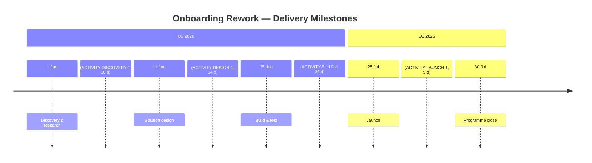

<!--
  Mermaid complementary view — Implementation & Migration layer: programme milestones.
  Renders in VS Code with Markdown Preview Mermaid Support (bierner.markdown-mermaid).

  Derived from:
    - canon/elements/05_implementation/activities/ACTIVITY-DISCOVERY-1.yaml
        start_date: "2026-06-01", duration_days: 10
    - canon/elements/05_implementation/activities/ACTIVITY-DESIGN-1.yaml
        duration_days: 14, predecessors: [ACTIVITY-DISCOVERY-1]
    - canon/elements/05_implementation/activities/ACTIVITY-BUILD-1.yaml
        duration_days: 30, predecessors: [ACTIVITY-DESIGN-1]
    - canon/elements/05_implementation/activities/ACTIVITY-LAUNCH-1.yaml
        duration_days: 5, predecessors: [ACTIVITY-BUILD-1]

  Milestone dates are computed from the activity chain:
    Discovery start:  2026-06-01 (explicit start_date on ACTIVITY-DISCOVERY-1)
    Design start:     2026-06-11 (Discovery + 10 d)
    Build start:      2026-06-25 (Design + 14 d)
    Launch start:     2026-07-25 (Build + 30 d)
    Programme close:  2026-07-30 (Launch + 5 d)

  Not a duplicate of the Activity Network (Gantt): the native Activity Network notation
  shows the full activity-on-node network with predecessors, durations, and critical path.
  This timeline projects the same chain as high-level delivery milestones — for
  executive status and stakeholder communication.
-->

# Onboarding Rework — Programme Milestones

Implementation & Migration view of the customer-onboarding rework programme.
Milestones are derived from the activity dependency chain
(`ACTIVITY-DISCOVERY-1` → `ACTIVITY-DESIGN-1` → `ACTIVITY-BUILD-1` → `ACTIVITY-LAUNCH-1`).

## Model references

| Milestone | Date | Source activity | Duration |
|---|---|---|---|
| Discovery start | 2026-06-01 | `ACTIVITY-DISCOVERY-1` (explicit `start_date`) | 10 d |
| Design start | 2026-06-11 | `ACTIVITY-DESIGN-1` (`predecessors: [ACTIVITY-DISCOVERY-1]`) | 14 d |
| Build start | 2026-06-25 | `ACTIVITY-BUILD-1` (`predecessors: [ACTIVITY-DESIGN-1]`) | 30 d |
| Launch | 2026-07-25 | `ACTIVITY-LAUNCH-1` (`predecessors: [ACTIVITY-BUILD-1]`) | 5 d |
| Programme close | 2026-07-30 | Computed end of Launch | — |

Goal served: `GOAL-CUST-1` (Raise customer satisfaction) via `ACTIVITY-DISCOVERY-1` + `ACTIVITY-DESIGN-1`
