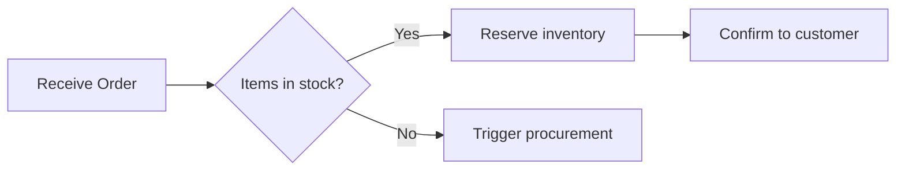

# `views/activities/`

Activity / sequence / flow diagrams in **Mermaid** notation. Mermaid is a widely-supported open-source diagramming standard (MIT-licensed); it renders natively in GitHub, GitLab, VS Code, Notion, Obsidian, and most modern documentation tools.

## File convention

`*.mmd`

(Standard Mermaid extension. No Transitrix-specific suffix — Mermaid is an external standard, used as-is.)

## Skeleton



## Inline alternative

For diagrams bound to a single markdown document, an inline ` ```mermaid ` block in the `.md` file is preferred over a separate `.mmd` file. Stand-alone `.mmd` files in this folder are for activities that have an independent life (referenced from multiple documents, exported to multiple tools).

## See also

- [Mermaid documentation](https://mermaid.js.org/) — syntax reference
- `method/methodology.md` §6 — notation kit
